# AMAZON ECR

Note  
Amazon Elastic Container Registry(ECR)를 Amazon ECS와 통합하여 Amazon ECS에서 실행되는 애플리케이션에 대한 컨테이너 이미지를 손쉽게 저장, 실행 및 관리할 수 있습니다. 태스크 정의에 Amazon ECR 리포지토리를 지정하기만 하면 Amazon ECS에서 애플리케이션에 적합한 이미지를 가져옵니다.

## Amazon ECR 소개


## 실습 단계


1. cats, dogs ECR 리포지토리 생성하기

2. Wokstation에 접속하여 cats, dogs 도커 이미지 빌드하고 태깅하기

3. 작업한 도커 이미지를 Amazon ECR로 푸시하기

# ECR 생성

Note  
이번 실습에서는 cats와 dogs가 사용할 ECR 리포지토리를 생성합니다. Amazon ECR는 개발자가 Docker 컨테이너 이미지를 손쉽게 저장, 관리 및 배포할 수 있게 해주는 완전관리형 Docker 컨테이너 레지스트리로, Amazon ECS와 통합되어 개발에서 프로덕션까지의 워크플로우를 간소화합니다.

1. Amazon ECR로 이동합니다. ECR을 처음 사용하는 경우 Welcome 페이지가 보입니다. Get Started를 클릭하거나 좌측 네비게이션 바에서 Repositories를 클릭합니다.

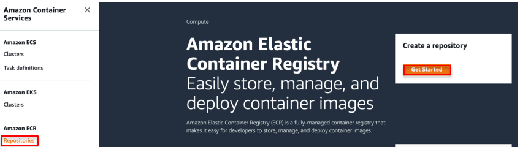

2. Create repository를 클릭하고 이름을 cats라고 지정합니다. 같은 방식으로 dogs 리포지토리도 생성합니다.CreateECR

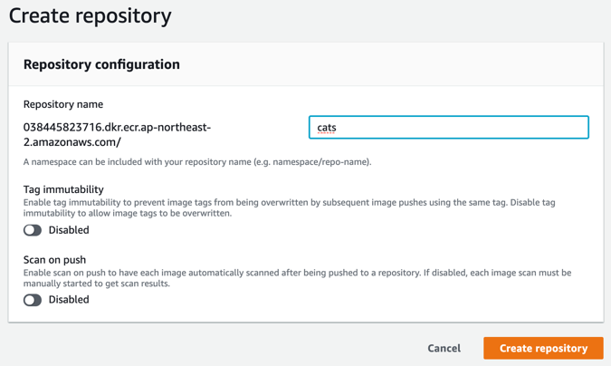

Warning  
리포지토리의 이름은 반드시 cats, dogs로 하셔야 다음 이미지 태그하고 ECR로 푸시하기 단계를 진행하실 수 있습니다.

1. 두 리포지토리가 잘 생성되었는지 확인합니다.

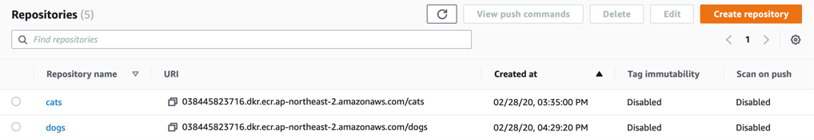

# 도커 이미지

Note  
이번 단계에서 실습자는 Workstation 인스턴스에 접속하여 Docker CLI를 이용해 cats와 dogs 도커 이미지를 빌드합니다.

1. Amazon EC2로 이동하여 Instances 목록에서 Workstation를 선택하고 IPv4 Public IP를 복사합니다. 터미널을 열고 SSH 접속합니다.

```
ssh -i [key pair name.pem] ec2-user@[Workstation Public IP]
```

TIP  
로컬 터미널을 사용하지 않아도 EC2에 웹 브라우저에서 간편하게 접속할 수 있습니다. Workstation을 클릭하고 Connect를 클릭하여 세 가지 Connection method 중 EC2 Instance Connect (browser-based SSH connection)를 선택합니다. User name은 root가 아닌 ec2-user를 사용하시는 것이 보안상 좋습니다.

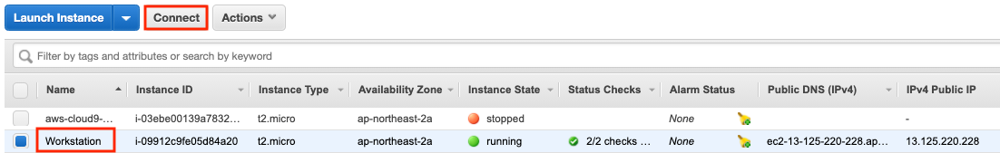

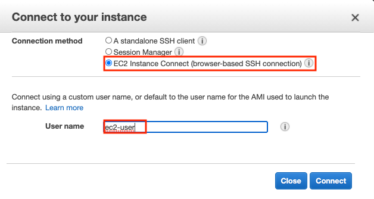

2. cats와 dogs의 Dockerfile 내용을 확인합니다. 도커는 Dockerfile을 읽어 자동으로 이미지를 빌드합니다. Dockerfile은 이미지 조립하기 위해 호출해야 하는 커맨드들을 담고 있습니다.

```
cd catsdogs 
cd cats 
cat Dockerfile
```

cats 디렉토리의 Dockerfile은 cats 도커 이미지를 빌드하기 위해 필요합니다. 어떤 내용을 담고 있는지 리눅스 cat 명령어를 이용하여 확인합니다.

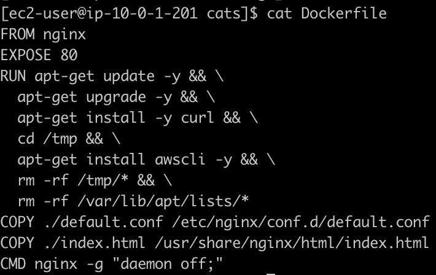

[Dockerfile](https://docs.docker.com/engine/reference/builder/#dockerfile-reference) 의 FROM, RUN 등이 무엇을 의미하는지 더 알아봅니다. 예를 들어 FROM 명령어는 새 빌드 단계를 초기화하고 후속 명령어에 대한 기본 이미지를 설정합니다.

3. cats를 빌드합니다.

```
docker build -t cats . 
```

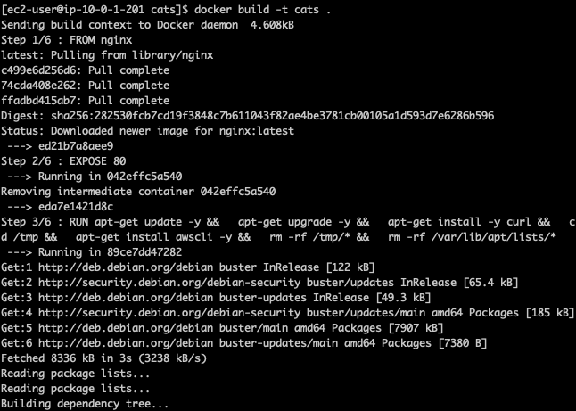

4. dogs에서도 동일한 작업을 수행하기 위해 디렉토리를 이동합니다.

```
cd ..
cd dogs
cat Dockerfile 
```

마찬가지로 이 Dockerfile은 dogs 도커 이미지를 빌드하기 위해 필요합니다.

5. dogs를 빌드합니다.

```
docker build -t dogs .
```

# 이미지 태그하고 ECR로 푸시하기

Note  
이번 단계에서 실습자는 앞 단계에서 작업한 도커 이미지를 latest로 태깅한 후 cats, dogs 리포지토리로 푸시합니다.

1. 이미지를 태그하고 푸시하기 위해 Workstation에서 ECR로 로그인합니다.

```
sudo aws ecr get-login --no-include-email --region ap-northeast-2
```

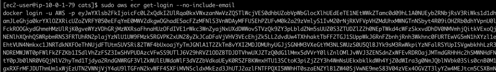

```
sudo su
$(aws ecr get-login --no-include-email --region ap-northeast-2)
```

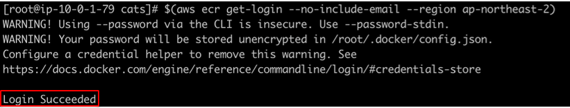

Login Succeeded 메세지가 떴는지 확인합니다.

2. cats와 dogs 이미지를 태깅한 후 각각 ECR로 푸시합니다. Amazon ECR의 Repositories에서 View push command를 클릭하여 빌드, 태깅, 푸시 명령어를 참조합니다.

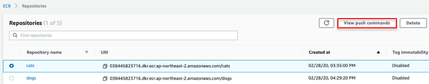

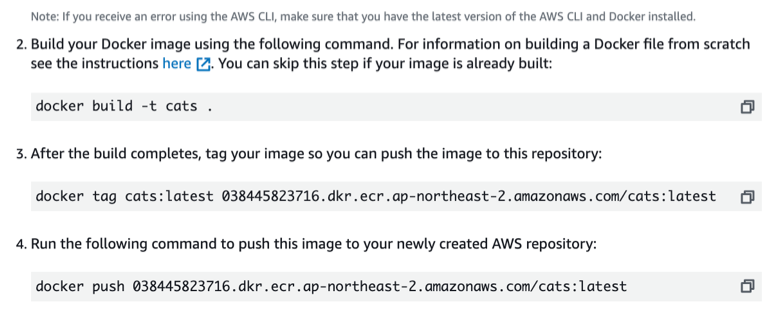

3. View push command의 세 번째, 네 번째 명령어를 복사하여 Workstation에서 실행합니다.

Warning  
cats Repository URI, dog Repository URI는 실습자 본인의 URI여야 합니다.

```
docker tag cats:latest cats Repository URI:latest 
```

```
docker push cats Repository URI:latest 
```

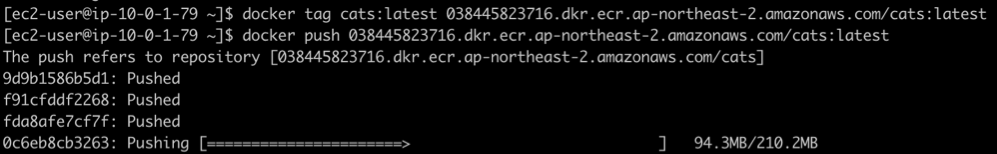

4. Dogs도 동일한 작업을 수행합니다.

```
docker tag dogs:latest dogs Repository URI:latest 
```

```
docker push dogs Repository URI:latest
```

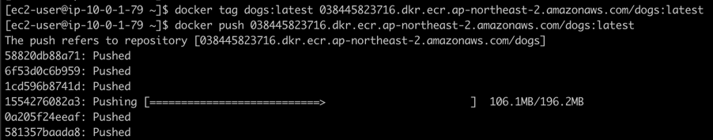

5. cats와 dogs 리포지토리에 각각 latest 태그를 가진 도커 이미지가 잘 저장되었는지 확인합니다.


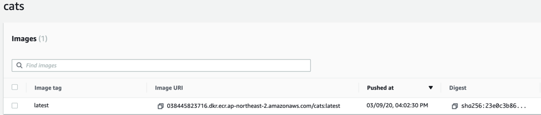

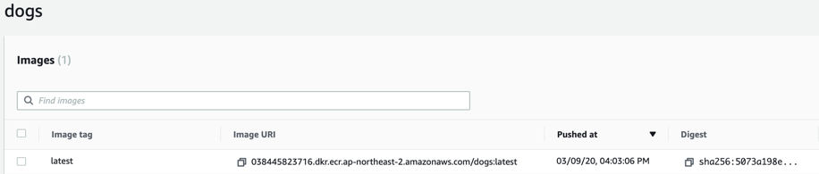