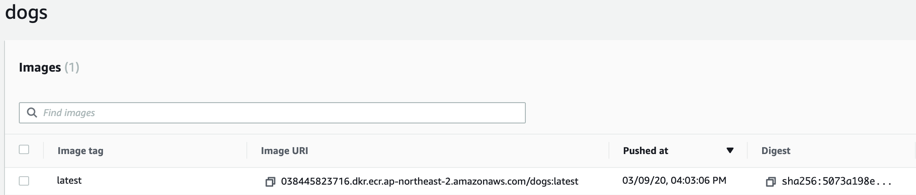

# AMAZON ECS
본 실습은 다음 순서대로 진행됩니다.

## ECS 클러스터
- 클러스터 생성
- 클러스터 IAM 역할

## ECS 작업 정의
- web 작업 정의
- cats 작업 정의
- dogs 작업 정의

## ECS 서비스
- ALB 생성
- web 서비스
- cats 서비스
- dogs 서비스
- 서비스 확인

# ECS 클러스터

Note  
Amazon ECS 클러스터는 작업 또는 서비스의 논리적 그룹입니다. 이번 실습에서는 고가용성을 위해 2개 가용영역에 DEMOGO-ECS 클러스터를 배포하고, 다음 실습 단계인 5. 모니터링 실습에 필요한 IAM 권한을 ECS 인스턴스에 부여합니다.


1. DEMOGO-ECS 클러스터 생성
2. ecsInstanceRole에 CloudWatch Logs 권한 부여

## 클러스터 생성

Note  
이번 챕터에서는 EC2 리눅스 클러스터 DEMOGO-ECS와 클러스터 인스턴스가 사용할 IAM 역할(role) ecsInstanceRole을 생성합니다.

1. Amazon ECS로 이동합니다. ECS를 이용하는게 처음이라면 Get started 화면이 보일 것입니다. 무시하고 Amazon ECS 좌측 네비게이터에서 Clusters로 이동합니다. Create Cluster를 클릭합니다.


2. Step 1: Select cluster template – EC2 Linux + Networking을 선택합니다.


3. Step 2: Configure clusterConfigure


- Cluster name: DEMOGO-ECS

- Instance Configuration

    - Provisioning model: On-Demand Instance

    - EC2 Instance type: m5d.large

    - Number of instances: 2

    - EC2 AMI id: Amazon Linux 2 AMI

    - EBS storage: 22

    - Key pair: 키 파일을 선택합니다.


4. Networking

- VPC: DemoGoECSVPC (10.0.0.0/16)

- Subnets: Private subnet 1,2 (10.0.3.0/24, 10.0.4.0/24)

- Security Group: ecs-demogo-ECSInstanceSG

2. Container instance IAM role: Create new role를 선택합니다. ecsInstanceRole라는 이름으로 자동 생성합니다.


Note  
이전에 ecsInstanceRole을 생성한 적이 있다면 ecsInstanceRole을 드롭다운에서 선택합니다. 다음 단계에서 권한을 추가로 부여할 것입니다. 만약 ecsInstanceRole 권한을 수정이 불가한 경우 실습용 IAM role을 따로 생성하여 진행합니다.

5. CloudWatch Container Insights: Enable Container Insights를 체크하고 Create을 클릭합니다.ContainerInsight


# 클러스터 IAM 역할

Note  
ECS 인스턴스는 AWS FireLens를 통해 CloudWatch Logs로 컨테이너 로그를 송출하기 위해 액세스 권한이 필요합니다. 앞 단계에서 자동 생성한 ECS 인스턴스의 IAM 역할인 ecsInstanceRole에 CloudWatchLogsFullAccess를 추가합니다.

## ECS 인스턴스 IAM Role에 권한 추가

1. IAM 역할(roles)로 이동합니다.

2. ecsInstancerole를 검색합니다. (만약 기존의 다른 IAM 역할을 사용한 경우 그 역할 이름을 검색합니다.)

3. 해당 역할을 선택하고 Attach policies를 클릭합니다.


4. CloudWatchLogsFullAccess 정책을 검색하고 선택합니다.


5. CloudWatchLogsFullAccess 정책이 잘 추가되었는지 확인합니다.


# ECS 작업 정의

Note  
Amazon ECS에서 Docker 컨테이너를 실행하려면 작업 정의(Task Definition)가 필요합니다. Amazon ECR 실습에서 생성한 cats, dogs의 도커 이미지를 참조하는 catsdef, dogsdef 작업 정의를 생성합니다. web 작업 정의가 사용할 도커 이미지는 별도로 제공됩니다.

작업 정의에서 지정할 수 있는 몇몇 파라미터는 다음과 같습니다. 각 파라미터에 대해 더 알아봅니다.

- 작업의 각 컨테이너에 사용할 도커 이미지

- 각 작업 또는 작업 내 각 컨테이너에서 사용할 CPU 및 메모리의 양

- 사용할 시작 유형(Launch Type)으로서 해당 작업(Task)이 호스팅되는 인프라를 결정

- 작업의 컨테이너에 사용할 도커 네트워킹 모드

- 작업에 사용할 로깅 구성 등


실습 순서

1. web 작업 정의 생성

2. catsdef 작업 정의 생성

3. dogsdef 작업 정의 생성

# WEB 작업 정의

Note  
Web 작업 정의는 EC2 타입으로 생성합니다. Web이 사용할 도커 이미지는 본 실습에서 제공하는 URI를 사용합니다. 별도로 설명하지 않은 설정은 기본값으로 둡니다.

## Web 작업 정의 생성

1. Amazon ECS Task definition로 이동하여 Create new Task Definition을 클릭합니다.

2. Select launch type compatibility: EC2를 선택합니다.


3. Task Definition Name: web를 입력합니다.


4. Container Definitions까지 스크롤을 내린 후 Add container를 클릭합니다.


5. Web 컨테이너를 설정합니다.


- Container name: web

- Image: 038445823716.dkr.ecr.ap-northeast-2.amazonaws.com/web:latest

- Memory Limits - Hard limit 128

- Port mappings

- Host port: 0

- Container port: 80

6. 우측 하단의 Add를 클릭합니다. 창이 닫힙니다.

7. 하단의 create을 클릭하여 web 작업 정의를 생성합니다.

# CATS 작업 정의

Note  
Cats 작업 정의는 web과 마찬가지로 EC2 타입을 선택합니다. 추가로 로그 라우터인 FireLens를 활성화하여 컨테이너 로그를 Amazon CloudWatch Logs로 전송하도록 설정합니다.

## catsdef 생성

1. Amazon ECS Task definition으로 이동하여 새 작업 정의를 생성합니다.

2. Select launch type compatibility: EC2를 선택합니다.


3. Task Definition Name: catsdef를 입력합니다.

## FireLens 구성

## FireLens 활성화
Log Router Integration까지 스크롤을 내린 후 Enable Firelens Intigration 박스에 체크되어 있는지 확인합니다. fluentbit 타입을 선택하고 Apply를 클릭합니다.

Note  
AWS는 CloudWatch Logs 및 Kinesis Data Firehose 용 플러그인이 포함된 Fluent Bit 이미지를 제공합니다. Fluentd보다는 Fluent Bit이 리소스 사용률이 낮기 때문에 이를 로그 라우터로 사용하는 것이 좋습니다. 자세한 내용은 Fluent Bit용 CloudWatch Logs 및 Fluent Bit용 Amazon Kinesis Firehose을 참고합니다.


다시 Container Definitions로 돌아와서 log_router컨테이너가 생성된 것을 확인합니다.


### log_router 컨테이너의 로그 설정
log_router 컨테이너를 클릭하여 Advanced container configuration – STORAGE AND LOGGING에서 로그를 설정합니다.

1. Log configuration: Auto-configure CloudWatch Logs가 선택 해제되어 있는지 확인합니다.

2. 다음과 같이 로그를 설정합니다.


- Log driver: awslogs

- Log options: 키/값을 다음과 같이 작성합니다. 정확한 설정을 위해 복사 및 붙여넣기를 권장합니다.

| Key | Value | 입력값 |
| --- | ----- | ---- |
| awslogs-group | Value | firelens-container |
| awslogs-region | Value | ap-northeast-2 |
| awslogs-stream-prefix | Value | firelens |
| awslogs-create-group | Value | true |

3. 맨 하단에서 Update를 클릭하여 log_router의 설정을 마칩니다.

### cats 컨테이너 추가
Container Definitions에서 Add container를 클릭하여 cats 컨테이너를 추가합니다.


1. cats 컨테이너를 다음과 같이 구성합니다.

- Container name: cats

- Image: 실습자의 cats latest 이미지 URI 입력

TIP  
브라우저에서 새 탭을 열어 ECR로 이동합니다. cats 리포지토리의 latest 태그된 이미지 URL 앞의 네모를 클릭하여 복사합니다. dogs도 동일한 작업을 수행해야 하므로 다음 단계까지 창을 열어둡니다.


- Memory Limits - Hard limit 128

- Port mappings

    - Host port: 0

    - Container port: 80 (tcp)

### cats 컨테이너 로그 설정
Advanced container configuration – STORAGE AND LOGGING에서 cats 컨테이너의 로그를 설정합니다.

1. Log configuration: Auto-configure Cloudwatch Logs가 선택 해제되어 있는지 확인합니다.

2. 다음과 같이 cats 컨테이너의 로그를 설정합니다.


- Log driver: awsfirelens

- Log options

| Key | Value | 입력값 |
| --- | ----- | ---- |
| Name | Value | cloudwatch |
| log_group_name | Value | ecs-demogo-log |
| log_stream_prefix | Value | from-fluent-bit |
| region | Value | ap-northeast-2 |
| auto_create_group | Value | true |

3. Add를 누르면 창이 닫힙니다. cats 컨테이너가 추가된 것을 확인합니다.

4. Create 클릭하여 catsdef 생성을 마칩니다.

TIP  
아래의 JSON 템플릿을 이용해 위의 번거로운 GUI 작업 없이 동일한 cats 작업 정의를 구성할 수 있습니다. 콘솔에서 JSON을 붙여넣거나 파일로 저장 후 AWS CLI –cli-input-json 옵션을 사용할 수 있습니다.

Task Definition 생성 화면에서 스크롤을 내리면 Configure via JSON 버튼이 있습니다.


```
{
  "ipcMode": null,
  "executionRoleArn": null,
  "containerDefinitions": [
    {
      "dnsSearchDomains": null,
      "environmentFiles": null,
      "logConfiguration": null,
      "entryPoint": null,
      "portMappings": [],
      "command": null,
      "linuxParameters": null,
      "cpu": 0,
      "environment": [],
      "resourceRequirements": null,
      "ulimits": null,
      "dnsServers": null,
      "mountPoints": [],
      "workingDirectory": null,
      "secrets": null,
      "dockerSecurityOptions": null,
      "memory": null,
      "memoryReservation": 50,
      "volumesFrom": [],
      "stopTimeout": null,
      "image": "906394416424.dkr.ecr.ap-northeast-2.amazonaws.com/aws-for-fluent-bit:latest",
      "startTimeout": null,
      "firelensConfiguration": {
        "type": "fluentbit",
        "options": null
      },
      "dependsOn": null,
      "disableNetworking": null,
      "interactive": null,
      "healthCheck": null,
      "essential": true,
      "links": null,
      "hostname": null,
      "extraHosts": null,
      "pseudoTerminal": null,
      "user": "0",
      "readonlyRootFilesystem": null,
      "dockerLabels": null,
      "systemControls": null,
      "privileged": null,
      "name": "log_router"
    },
    {
      "dnsSearchDomains": null,
      "environmentFiles": null,
      "logConfiguration": {
        "logDriver": "awsfirelens",
        "secretOptions": null,
        "options": {
          "log_group_name": "ecs-demogo-log",
          "auto_create_group": "true",
          "log_stream_prefix": "from-fluent-bit",
          "region": "ap-northeast-2",
          "Name": "cloudwatch"
        }
      },
      "entryPoint": null,
      "portMappings": [
        {
          "hostPort": 0,
          "protocol": "tcp",
          "containerPort": 80
        }
      ],
      "command": null,
      "linuxParameters": null,
      "cpu": 0,
      "environment": [],
      "resourceRequirements": null,
      "ulimits": null,
      "dnsServers": null,
      "mountPoints": [],
      "workingDirectory": null,
      "secrets": null,
      "dockerSecurityOptions": null,
      "memory": 128,
      "memoryReservation": null,
      "volumesFrom": [],
      "stopTimeout": null,
      "image": "038445823716.dkr.ecr.ap-northeast-2.amazonaws.com/cats:latest",
      "startTimeout": null,
      "firelensConfiguration": null,
      "dependsOn": null,
      "disableNetworking": null,
      "interactive": null,
      "healthCheck": null,
      "essential": true,
      "links": null,
      "hostname": null,
      "extraHosts": null,
      "pseudoTerminal": null,
      "user": null,
      "readonlyRootFilesystem": null,
      "dockerLabels": null,
      "systemControls": null,
      "privileged": null,
      "name": "cats"
    }
  ],
  "placementConstraints": [],
  "memory": null,
  "taskRoleArn": null,
  "compatibilities": [
    "EC2"
  ],
  "taskDefinitionArn": "arn:aws:ecs:ap-northeast-2:038445823716:task-definition/catsdef:16",
  "family": "catsdef",
  "requiresAttributes": [
    {
      "targetId": null,
      "targetType": null,
      "value": null,
      "name": "com.amazonaws.ecs.capability.ecr-auth"
    },
    {
      "targetId": null,
      "targetType": null,
      "value": null,
      "name": "ecs.capability.firelens.fluentbit"
    },
    {
      "targetId": null,
      "targetType": null,
      "value": null,
      "name": "com.amazonaws.ecs.capability.docker-remote-api.1.19"
    },
    {
      "targetId": null,
      "targetType": null,
      "value": null,
      "name": "com.amazonaws.ecs.capability.docker-remote-api.1.21"
    },
    {
      "targetId": null,
      "targetType": null,
      "value": null,
      "name": "com.amazonaws.ecs.capability.logging-driver.awsfirelens"
    }
  ],
  "pidMode": null,
  "requiresCompatibilities": [
    "EC2"
  ],
  "networkMode": null,
  "cpu": null,
  "revision": 16,
  "status": "ACTIVE",
  "inferenceAccelerators": null,
  "proxyConfiguration": null,
  "volumes": []
}
```

# DOGS 작업 정의

Note  
Dogs는 web, cats와 달리 Fargate 시작 유형(launch type)을 사용하기 때문에 몇몇 설정 옵션에서 차이가 있습니다. 예를 들어, Amazon ECS의 Fargate 작업 정의(task definitions)는 태스크 수준에서 CPU와 메모리를 지정해야 합니다. Fargate 태스크는 awsvpc 네트워크 모드를 지정해야 하고 각 태스크별 ENI(Elastic Network Interface)를 부여합니다. AWS ECS on AWS Fargate에 대해 더 알아봅니다.

## Dogs 작업 정의 생성하기

1. Amazon ECS Task definition으로 이동하여 새 작업 정의를 생성합니다.

2. Select launch type compatibility: Fargate를 선택합니다.


3. Task Definition Name: dogsdef를 입력합니다.


4. Task size


- Task memory (GB): 0.5GB

- Task CPU (vCPU): 0.25 vCPU

5. Container Definitions에서 dogs 컨테이너를 추가하기 위해 Add container를 클릭합니다.


6. dogs 컨테이너를 설정합니다.


- Container name: dogs

- Image: 실습자의 dogs latest 이미지 URI
    - ECR를 열어둔 탭에서 복사합니다.
    


- Memory Limits: Soft limit 128

- Port mappings: Container port 80

7. Add를 누르면 창이 닫힙니다. dogs 컨테이너가 추가된 것을 확인합니다.

8. Create을 클릭하여 dogsdef 생성을 마칩니다.

# ECS 서비스

Note  
Amazon ECS를 사용하여 Amazon ECS 클러스터에서 지정된 수의 작업 정의 인스턴스를 동시에 실행하고 관리할 수 있습니다. 이를 서비스라고 합니다. 어떤 이유로 작업이 실패 또는 중지되는 경우 Amazon ECS 서비스 스케줄러가 작업 정의의 다른 인스턴스를 시작하여 이를 대체하고 사용되는 일정 전략에 따라 서비스의 원하는 작업 수를 유지합니다.


Note  
서비스에서 원하는 작업 수를 유지하는 이외에 선택적으로 로드 밸런서를 통해 서비스를 실행할 수 있습니다. 로드 밸런서는 서비스와 연결된 작업 간에 트래픽을 분산합니다.

이번 단계에서는 앞 챕터에서 생성한 작업 정의(Task Definitions)를 참조하는 3가지 서비스 web, cats, dogs를 생성합니다. 이 서비스들은 ALB 경로 패턴별 타겟 그룹과 연계되어 있습니다.


- web 타겟 그룹 - 경로 패턴 /

- cats 타겟 그룹 - 경로 패턴 /cats

- dogs 타겟 그룹 - 경로 패턴 /dogs

# ALB 생성

Note  
간단한 웹 서비스인 cats and dogs로 트래픽을 분배할 Application Load Balancer를 생성합니다. 실습에서 언급하지 않은 설정은 기본값으로 남겨둡니다.

## DEMOGO-ALB 생성

1. EC2 Load Balancers로 이동합니다.

2. Create Load Balancer를 클릭하고 Application Load Balancer를 선택합니다.


3. Step 1: Configure Load Balancer

- Name: demogo-albConfig


4. 가용 영역


- VPC: DemoGoECSVPC (10.0.0.0/16)

- 가용영역 ap-northeast-2a와 ap-northeast-2b를 모두 체크합니다.

- Subnet: PublicSubnet1, 2를 선택합니다.

5. Click Next: Configure Security Settings.

6. Step 2: Configure Security Settings - 다음 단계로 넘어갑니다.

7. Step 3: Configure Security Groups existing security group이 선택되었는지 확인하고 default 보안그룹은 선택 해제하고 ecs-demogo-ALBSG를 선택합니다.


8. Step 4: Configure Routing


- Target group: New target group

- Name: web

- Target type: Instance (앞 단계에서 생성한 web 작업 정의가 EC2 타입이기 때문입니다.)

- Port: 80

9. Step 5: Register Targets - 다음 단계로 넘어갑니다.

10. Step 6: Review and create - 설정값을 리뷰한 후 ALB를 생성합니다.

# WEB 서비스

## Web 서비스 생성하기

1. Amazon ECS로 이동하여 DEMOGO-ECS 클러스터를 선택합니다. Web 서비스를 생성하기 위해 Services 탭에서 Create을 클릭합니다. 별도 설명이 없는 설정은 기본값으로 남겨둡니다.


2. Step 1: Configure service


- Launch type: EC2

- Task Definition

    - Family: web

    - Revision: 1 (latest) (Revision 값이 여러개라면 ‘latest'를 선택합니다.)

- Service name: web

- Number of tasks: 2

- Task Placement: AZ Balanced Spread을 선택하고 Next step을 클릭합니다.

3. Step 2: Configure networkWebLB


- Load balancer type: Application Load Balancer
    
    - Service IAM role: ecsServiceRole (만약 IAM role이 없다면 create new role을 선택합니다.)

    - Load balancer name: demogo-alb를 선택합니다.


- Container to load balance: web:0:80을 선택하고 Add to load balancer를 클릭합니다.


- Production listener port: 드롭다운에서 80:HTTP를 선택합니다.

- Target group name: 드롭다운에서 web을 선택합니다. 그러면 다른 옵션들은 자동으로 채워집니다.

4. Service discovery (optional) – 체크박스를 선택 해제하고 Next를 클릭합니다.


5. Set Auto Scaling: Do not adjust the service’s desired count를 선택합니다.


Note  
실습 6. 오토스케일링에서 web을 업데이트하여 서비스 오토스케일링을 설정할 것입니다. 지금 단계에서는 자동 조정을 비활성화한 상태로 실습을 계속합니다.


6. Review: 설정을 검토하고 web 서비스를 생성합니다.

7. View services를 클릭하여 2개의 web 태스크가 생성된 것을 확인합니다.Check


# CATS 서비스

## Cats 서비스 생성하기

1. DEMOGO-ECS 클러스터의 Services 탭에서 Create을 클릭합니다.

2. Step 1: Configure service


- Launch type: EC2

- Task Definition Family: catsdef Revision: 1 (latest)

- Service name: cats

- Number of tasks: 2

- Task Placement: AZ Balanced Spread

3. Next step을 클릭합니다.

4. Step 2: Configure network

- Load balancing

    - Load balancer type – Application Load Balancer

    - Load balancer name: demogo-alb를 선택합니다.

5. cats:0:80이 선택된 상태에서 Add to load balancer를 클릭합니다.


6. Container to load balance를 설정합니다.


- Production listener port: 80:HTTP

- Target group name: create new를 선택하고 cats를 입력합니다.

- path pattern: /cats*, Evaluation order: 1

- Health check path: /cats/

7. Service discovery: 선택 해제합니다.


8. Set Auto Scaling: Do not adjust the service’s desired count를 선택합니다.


9. Review: 검토 후 cats 서비스를 생성합니다.

# DOGS 서비스

## Dogs 서비스 생성하기

1. DEMOGO-ECS 클러스터의 Services 탭에서 Create을 클릭합니다.

2. Step 1: Configure service


- Launch type: Fargate

- Task Definition Family: dogsdef Revision: 1 (latest)

- Service name: dogs

- Number of tasks: 2

- Task Placement: AZ Balanced Spread

3. Next step을 클릭합니다.

4. Configure network


- Cluster VPC: 10.0.0.0/16 (DemoGoECSVPC)

- Subnets: PrivateSubnet1(10.0.3.0/24)과 PrivateSubnet2(10.0.4.0/24)을 선택합니다.

- Security Group: 자동으로 새로 생성합니다.

- Auto-assgin public IP: DISABLED

5. Load balancer type으로 Application Load Balancer을 선택합니다.

6. Container name: dogs:80:80이 선택된 상태에서 Add to load balancer를 클릭합니다.


Container to load balance를 설정합니다.


- Production Listener port: 80:HTTP를 선택합니다.

- Target group name: create new를 선택하고 dogs를 입력합니다.

- path pattern: /dogs*, Evaluation order: 2

- Health check path: /dogs/

7. Service discovery: 선택 해제합니다.


8. Set Auto Scaling: Do not adjust the service’s desired count를 선택합니다.


9. Review: 검토 후 dogs 서비스를 생성합니다.

# 서비스 확인

1. ECS DEMOGO-ECS 클러스터의 각 서비스가 ACTIVE 상태인지, Running task를 2개씩 가지고 있는지 확인합니다.


2. Tasks 탭에서 각 태스크의 상태가 RUNNING인지 확인하고 Container instance를 살펴봅니다. 시작 유형(Launch Types)은 설정한 대로 EC2와 FARGATE가 혼합되어 있습니다. FARGATE 유형인 dogs 서비스는 Container instance 정보가 없는 것을 알 수 있습니다.


3. Amazon EC2 Load Balancers로 이동합니다. demogo-alb의 DNS Name을 복사하여 웹브라우저에 붙여 넣으면 Web 메인 페이지로 이동합니다.


4. I♥Cats와 I♥Dogs 배너를 각각 클릭해보세요. 멋진 친구들이 당신을 기다리고 있습니다!


Note  
축하합니다! 이렇게 단 하나의 서버도 구성하거나 관리, 패치, 리부팅할 필요 없이 Amazon ECS에서 간단한 컨테이너 애플리케이션을 배포했습니다.
