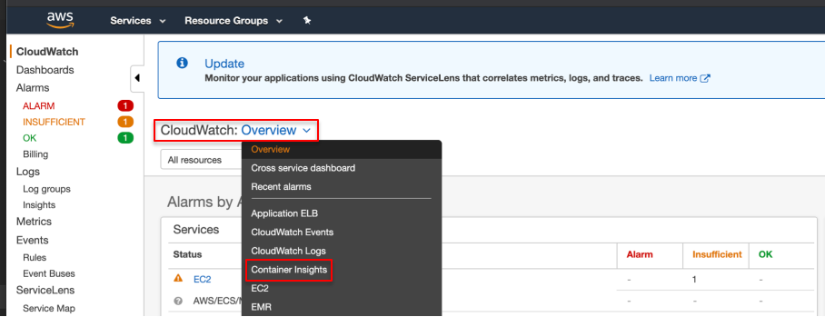
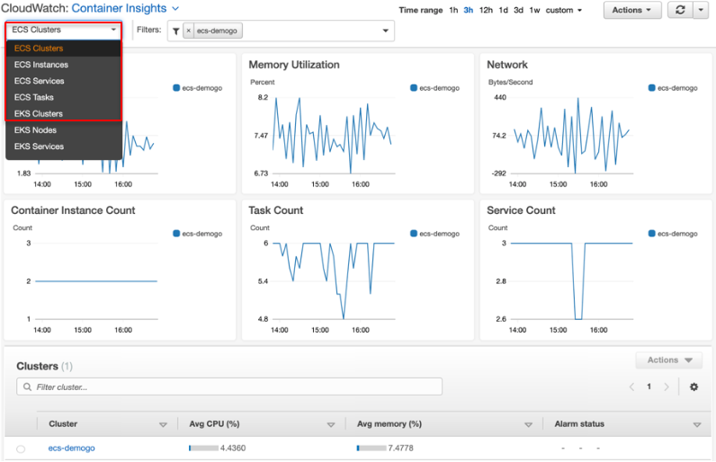
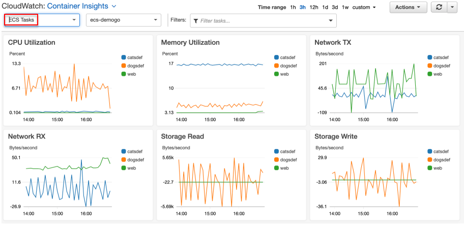
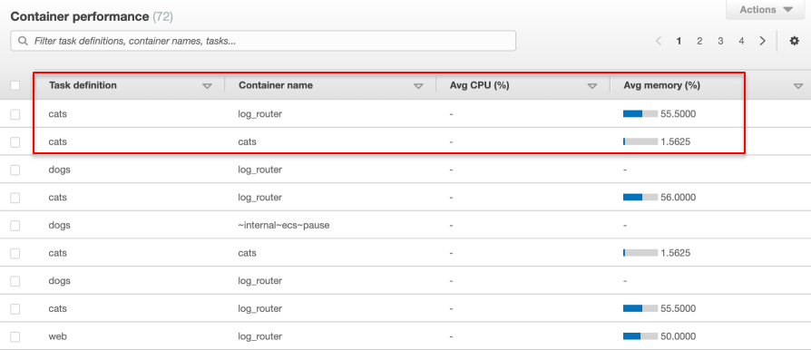
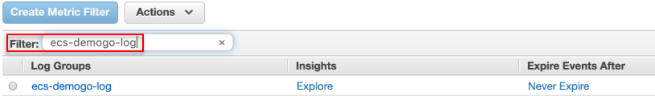
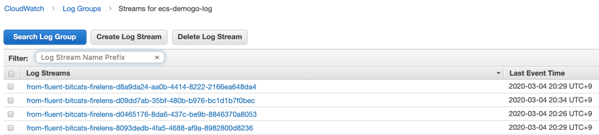
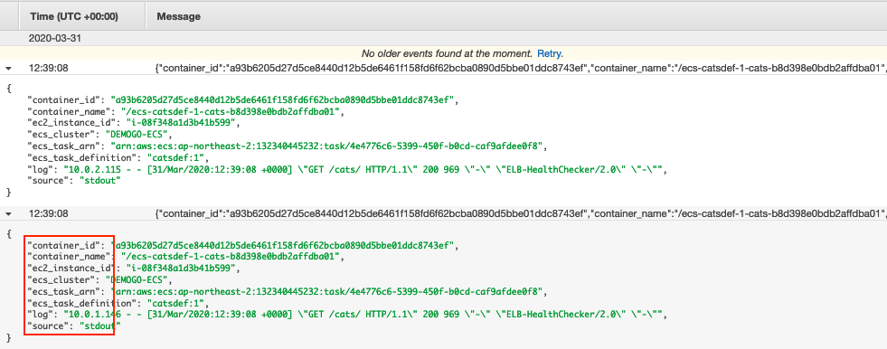

# 모니터링

모니터링은 Amazon ECS와 사용자 AWS 솔루션의 안정성, 가용성 및 성능을 유지하는 중요한 역할을 합니다. 다중 지점 실패(multi-point failure)발생시 이를 보다 쉽게 디버깅할 수 있도록 AWS 솔루션의 모든 부분으로부터 모니터링 데이터를 수집해야 합니다.

## Amazon CloudWatch 컨테이너 인사이트
CloudWatch Container Insights는 컨테이너 애플리케이션 및 마이크로서비스에 대한 CPU, 메모리, 디스크, 네트워크 같은 리소스 사용률 등의 지표와 로그를 수집 및 처리하여 요약합니다.

## AWS FireLens
FireLens는 Amazon ECS 및 AWS Fargate용 컨테이너 로그 라우터로, AWS의 서비스나 로그 분석 및 저장용 파트너 솔루션을 광범위하게 사용할 수 있는 확장성을 제공합니다. FireLens on Amazon ECS and AWS Fargate [다양한 샘플 아키텍처](https://github.com/aws-samples/amazon-ecs-firelens-examples)를 참고합니다. 이번 실습에서는 FireLens FluentBit과 CloudWatch Logs를 이용해 손쉽게 구성해봅니다.

## 컨테이너 인사이트
CloudWatch Container Insights를 사용해 컨테이너식 애플리케이션 및 마이크로서비스의 지표 및 로그를 수집하고 집계하며 요약할 수 있습니다. 이 지표에는 CPU, 메모리, 디스크, 네트워크 같은 리소스 사용률이 포함되어 있습니다. 또한 Container Insights는 컨테이너 재시작 오류 같은 진단 정보를 제공하여 문제를 격리하고 신속하게 해결할 수 있도록 도와줍니다.

### Container Insights로 ECS 모니터링하기
1. Amazon CloudWatch로 이동합니다.

2. 드롭다운에서 Container Insights를 선택합니다. CloudWatch가 ECS의 다양한 모니터링 지표들을 한 눈에 볼 수 있도록 자동 생성한 대시보드를 살펴봅니다.

3. ECS Clusters, ECS Services, ECS Tasks들을 하나씩 살펴봅니다. 지표별 상세 내용을 더 알아봅니다.

4. Container Insights는 ECS 클러스터 뿐만 아니라 태스크의 지표들도 수집합니다. 어떤 태스크가 클러스터의 CPU, 메모리, 네트워크, 스토리지 등의 리소스를 얼마나 소모하는지 감시할 수 있습니다. 모니터링하고자 하는 태스크를 검색합니다.

두 개 이상의 컨테이너를 가진 태스크인 경우 컨테이너별 Container Performance 지표들도 확인할 수 있습니다.

## AWS FIRELENS를 이용한 로그 라우팅

이번 실습을 위해 앞 실습 ECS 클러스터에서 ecsInstanceRole에 CloudWatchLogsFullAccess를 부여하고, ECS 작업 정의에서 catsdef 작업 정의를 생성할 때 FireLens를 활성화한 것입니다.

Amazon ECS용 FireLens를 사용하면 작업 정의 파라미터를 사용하여 로그를 AWS 서비스 또는 AWS 파트너 네트워크(APN) 대상으로 라우팅하여 로그를 저장 및 분석할 수 있습니다. 본 실습에서는 AWS가 제공한 Fluent Bit FireLens를 이용해 AWS 서비스인 CloudWatch Logs로 로그를 전송합니다.

1. [CloudWatch Log groups](https://ap-northeast-2.console.aws.amazon.com/cloudwatch/home?region=ap-northeast-2#logs:)로 이동합니다.
2. ecs-demogo-log를 검색합니다.

3. ecs-demogo-log를 클릭하고 각 로그 스트림을 살펴봅니다.

4. 각 로그를 펼쳐서 더 상세한 정보를 찾을 수 있습니다. container_id, ecs_cluster, etcs_task_definition 등의 정보를 담고 있습니다.

