# 오토스케일링

앞 실습 5. 모니터링에서 살펴본 것처럼 Amazon ECS는 서비스의 평균 CPU, 메모리 사용량 등을 CloudWatch의 지표를 게시합니다. 이와 함께 다른 CloudWatch 지표를 사용하여 사용률에 맞추어 서비스를 자동으로 확장 또는 축소합니다. 더 나아가 Amazon ECS 클러스터 오토스케일링을 사용하면 클러스터의 모든 태스크 및 서비스의 리소스 수요에 맞게 필요에 따라 자동으로 인스턴스를 확장할 수 있습니다. 본 실습에서 서비스와 클러스터에 부하테스트를 수행하여 어떻게 두 가지 오토 스케일링이 동작하는지 알아봅니다.

## Amazon ECS 서비스 오토스케일링


ECS는 수요에 맞게 서비스를 스케일 아웃(태스크 수를 추가)하거나 사용량이 적은 때에는 스케일 인(태스크 수를 감소)하여 자동으로 조정할 수 있습니다.

## Amazon ECS 클러스터 오토스케일링


ClusterAutoScaleECS Cluster Auto Scaling을 사용하면 EC2에서 실행되는 ECS 클러스터가 클러스터의 모든 태스크 및 서비스의 리소스 수요에 맞게 필요에 따라 자동으로 확장할 수 있습니다.

ECS Cluster Auto Scaling은 ECS에서 ECS 용량 공급자를 사용하여 사용자를 대신해 Amazon EC2 Auto Scaling 그룹(ASG)을 관리합니다. 사용자는 ASG의 관리형 확장을 활성화하고, ASG에서 초과 용량을 예약하고, ASG에서 인스턴스 종료를 관리하도록 용량 공급자를 구성할 수 있습니다.

> 원래 ECS는 ASG의 확장을 직접 관리하는 기능이 없었습니다. 그 대신 ECS 외부에서 ASG에 수동으로 확장 정책을 설정해야 했고, 확장에 제공되는 지표에는 사용자가 원하는 태스크 수가 반영되지 않고 이미 실행되는 태스크만 반영되었습니다.

## 실습 순서
- [서비스 오토스케일링](#서비스-오토스케일링)

- [클러스터 오토스케일링](#클러스터-오토스케일링)

## 서비스 오토스케일링

Amazon ECS는 수요에 맞게 서비스를 스케일 아웃(태스크 수를 추가)하거나 사용량이 적은 때에는 스케일 인(태스크 수를 감소)하여 자동으로 조정할 수 있습니다. 본 실습에서는 세 가지 서비스 중 web에 서비스 오토스케일링을 설정하여 테스트합니다.

.svg)

### 실습 순서

1. 서비스 오토스케일링 구성

2. 서비스 web 부하 테스트

3. 결과 확인

## 서비스 오토스케일링 구성

1. [Amazon ECS](https://console.aws.amazon.com/ecs) DEMOGO-ECS 클러스터로 이동합니다.

2. 서비스 탭에서 web을 선택하고 Update를 클릭합니다.WebUpdate

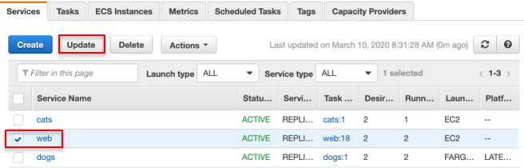

3. Step 1: Configure service - 다음 단계로 넘어갑니다.

4. Step 2: Configure network - 다음 단계로 넘어갑니다.

5. Step 3: Set Auto Scaling Service Auto Scaling: Configure Service Auto Scaling to adjust your service’s desired count을 선택합니다.

- Minimum number of tasks: 2

- Maximum number of tasks: 8

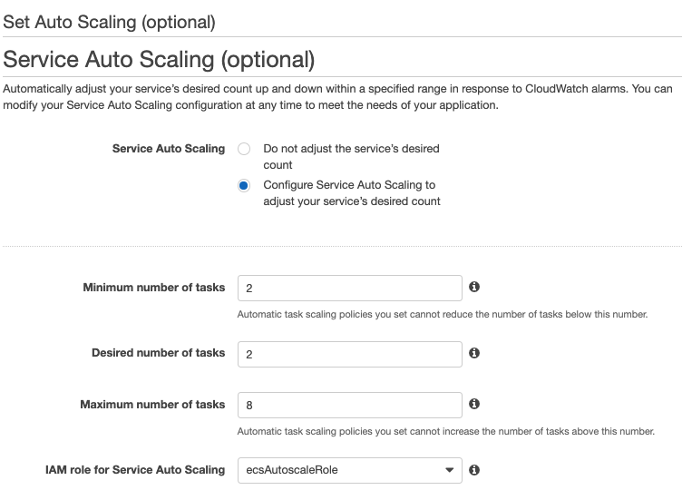

6. Automatic task scaling policies – Add scaling policy를 클릭합니다.

7. Add policy를 설정합니다.TargetTracking

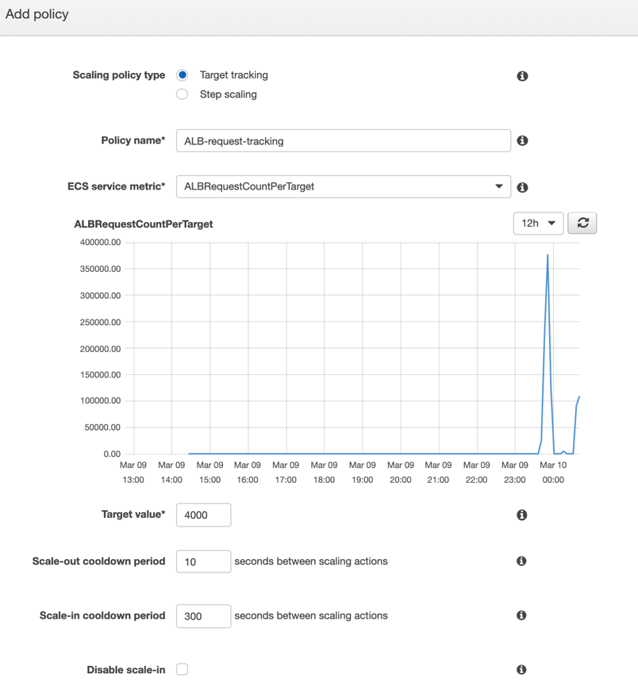

- Scaling policy type: Target tracking

- Policy name: ALB-request-tracking

- ECS service metric: ALBRequestCountPerTarget

각 ECS service metric을 선택할 때마다 최근의 추이를 참고할 수 있도록 그래프를 그려줍니다.

- Target value: 4000

- Scale-out cooldown period: 10 seconds

본 실습에서는 빠른 결과 확인을 위해 의도적으로 낮은 임계치를 설정합니다.

8. Next step으로 넘어가 Update Service를 클릭합니다.

### 서비스 부하 테스트

Workstation 인스턴스에 접속하여 부하 테스트를 위한 스크립트를 작성합니다. 이를 이용하여 서비스 web으로 부하 테스트를 수행합니다.

1. Workstation 인스턴스에 접속합니다.

```
ssh -i [key pair name.pem] ec2-user@[Workstation Public IP]
```

2. Workstation 인스턴스에서 예시로 넣어둔 service_loadtest.sh의 내용을 리눅스 cat 명령어를 이용해 살펴봅니다.LoadTestScript

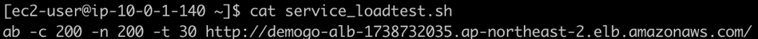

3. vi 편집기를 이용하여 service_loadtest_실습자이름.sh을 작성합니다. EC2 Load Balancers로 이동하여 demogo-alb의 DNS 이름을 메모장에 복사합니다.CopyALBDNS

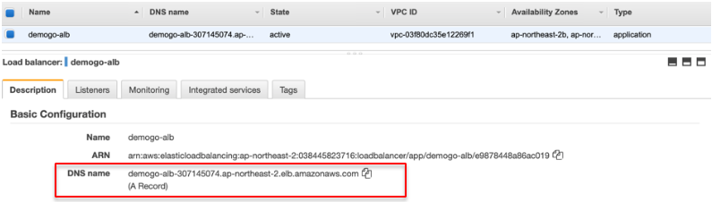

```
vi service_loadtest_[실습자이름].sh
```

```
ab -c 200 -n 200 -t 30 [실습자의 ALB DNS name] + / 
```

- /를 붙이는 이유는 서비스 web이 / 경로를 가지기 때문입니다.

- :wq!를 눌러 vi 편집을 마칩니다.

4. service_loadtest_실습자이름.sh 스크립트를 실행하기 위해 권한을 부여한 후 부하 테스트를 수행합니다. 연속으로 3분 이상 실행합니다. 다음 단계에서 모니터링합니다.

```
chmod 755 service_loadtest_[실습자 이름].sh
./service_loadtest_[실습자이름].sh
```

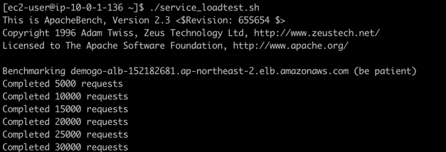

### 결과 확인

1. 다른 웹 브라우저 탭에 CloudWatch Alarms로 이동합니다.

2. 처음에는 알람의 상태가 Insufficient data일 수도 있습니다.

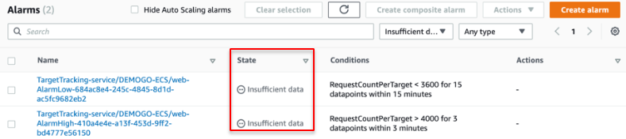

대상 추적 조정 정책(Target tracking scaling policy)은 지정한 지표에 데이터가 부족할 때(예: 네트워크 연결 문제 등으로 인해) 조정을 수행하지 않습니다. 데이터가 부족하다고 해서 사용량이 낮은 것으로 해석하지 않기 때문에 축소 역시 수행하지 않습니다.

3. Alarm의 이름을 클릭합니다. 아직 OK 상태일 수 있습니다. 빨간색 기준선 RequestCountPerTarget > 4000을 초과한 상태를 최소 3분 이상 유지해야 합니다.

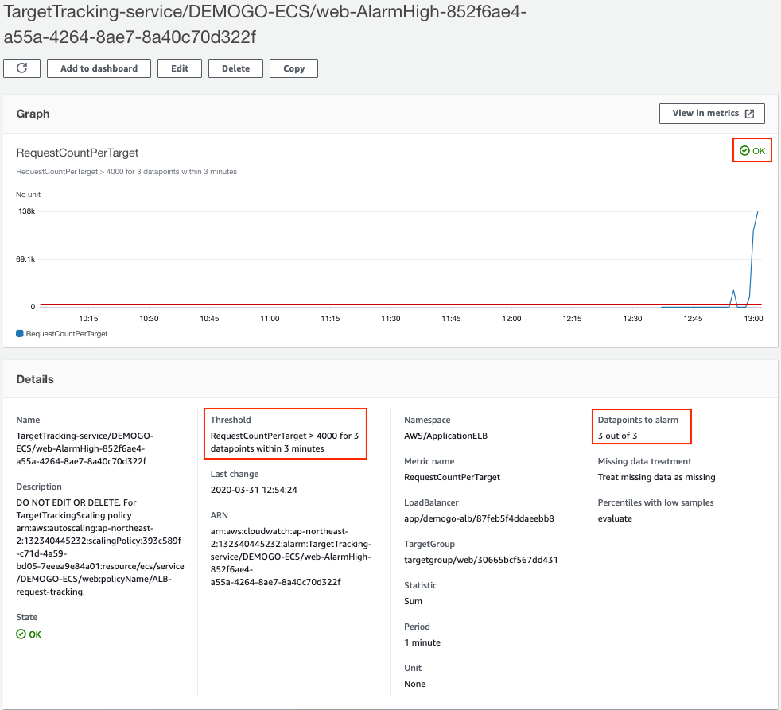

4. 계속해서 **service_loadtest_[실습자이름].sh**을 연속으로 몇 번 더 수행하면 CloudWatch 알람의 상태가 **In alarm**로 바뀌게 됩니다.

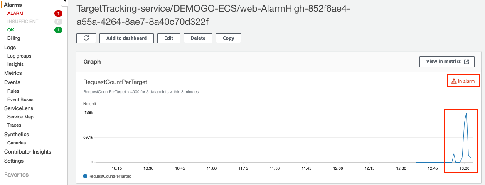

5. Events탭에서 서비스 web의 상태를 확인합니다. 언제 어떤 이벤트가 발생했는지 알 수 있습니다.

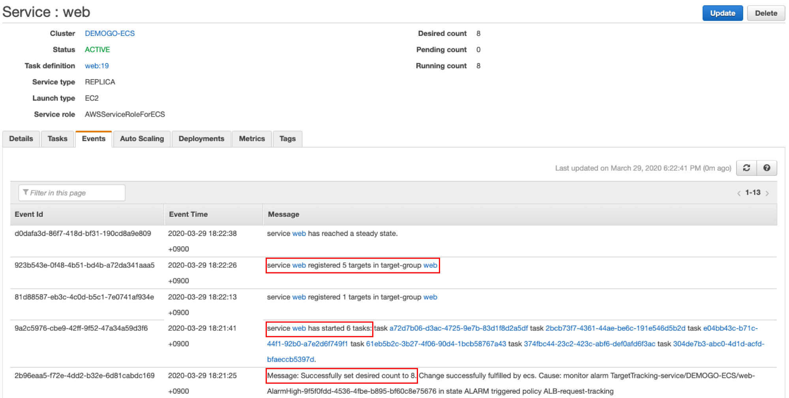

표 값과 실제 측정치 데이터 포인트 사이에는 차이가 발생할 수 있습니다. Application Auto Scaling이 추가하거나 제거할 용량을 결정할 때마다 항상 반올림 또는 내림을 통해 어림짐작으로 동작하기 때문입니다. 이는 용량을 부족하게 추가하거나 너무 많이 제거하는 일을 방지하기 위해서입니다.

6. Tasks 탭에서 Desired Count가 8이 되었음을 알 수 있습니다. 아직 Activating 상태인 태스크는 Desired status인 Running이 될 것입니다.

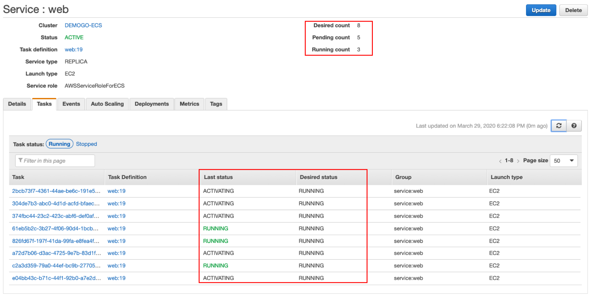

7. 시간이 흐른 뒤 서비스는 desired count를 조정하여 축소합니다. 결과적으로 서비스 web이 desired count를 7로 설정했기 때문에 동작 중인 8개 태스크 중 하나를 종료할 것입니다. 종료된 태스크는 ALB의 타겟 그룹에서 등록 해제됩니다.

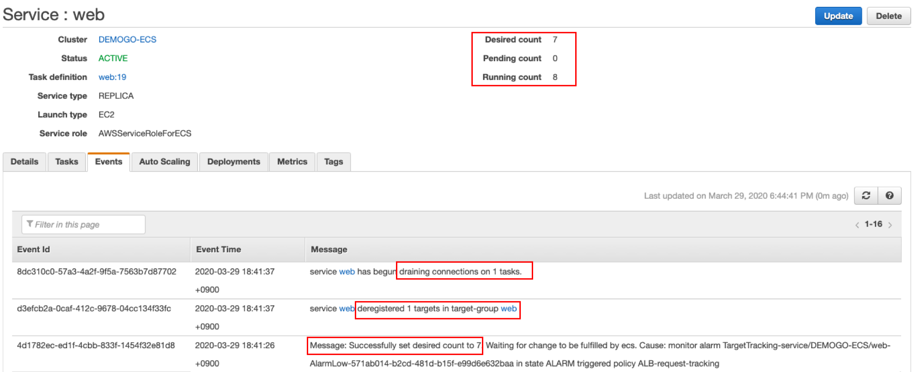

## 클러스터 오토스케일링
ECS Cluster Auto Scaling을 사용하면 ASG의 확장 정책은 ECS Capacity Provider를 통해 ECS에서 관리됩니다. 사용자는 ASG의 관리형 확장을 활성화하고, ASG에서 초과 용량을 예약하고, ASG에서 인스턴스 종료를 관리하도록 Capacity Provider를 구성할 수 있습니다.

EC2와 Fargate 모두에서 용량 공급자(Capacity Providers)를 사용할 수 있습니다. EC2를 사용하면 EC2 Auto Scaling 그룹(ASG)과 연결된 용량 공급자를 생성할 수 있습니다. 이를 통해 ASG의 확장을 관리하여 작업을 실행하는 데 필요한 용량이 아직 사용할 수 없는 경우에도 요청되도록 할 수 있습니다. 작업과 서비스를 실행할 때 여러 용량 공급자로 작업(Task)과 서비스를 분할할 수 있습니다. 본 실습에서는 ASG와 연결된 EC2 용량 공급자를 생성하고 부하 테스트를 수행하여 어떻게 클러스터 오토스케일링이 동작하는지 살펴봅니다.


## 실습 순서
1. 용량 공급자 생성

2. ASG(Auto Scaling Group) 구성

3. 클러스터 부하 테스트

4. 결과 확인

클러스터 오토스케일링에 대해 더 알아보고 싶다면 다음 [블로그](https://aws.amazon.com/blogs/containers/deep-dive-on-amazon-ecs-cluster-auto-scaling/)를 참고합니다.

### 용량 공급자 생성

1. [Amazon ECS](https://console.aws.amazon.com/ecs) DEMOGO-ECS 클러스터로 이동하여 Capacity Providers 탭을 선택합니다. Create을 클릭합니다.

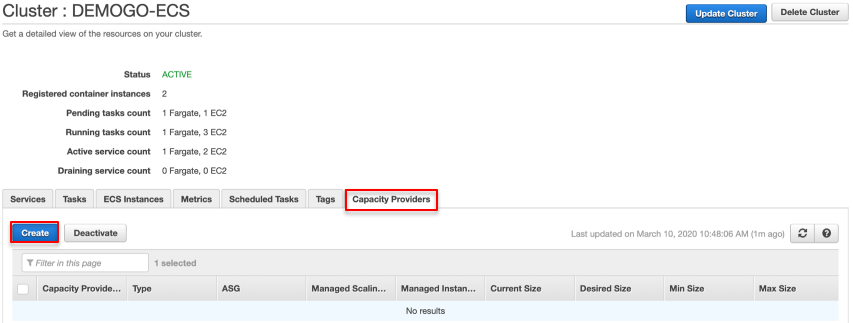

2. 용량 공급자 생성하기

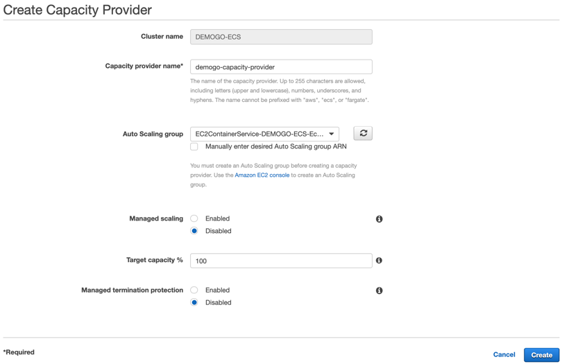

- Capacity provider name: demogo-capacity-provider

- Auto Scaling group: EC2ContainerService-[your cluster name]-EcsInstanceAsg

    - 이 ASG는 클러스터를 생성할 때 자동 생성된 것입니다.

- Managed scaling: Disabled을 선택합니다.

    - 실습을 위해 다음 단계에서 수동으로 구성합니다.

- Target capacity %: 100

- Managed termination protection: Disabled을 선택합니다.

관리형 확장을 사용하도록 설정한 경우 1과 100 사이의 정수를 지정합니다. 목표 용량 값은 Amazon ECS 관리형 대상 추적 조정 정책에 사용되는 CloudWatch 지표의 목표 값으로 사용됩니다. 이 목표 용량 값은 최선의 노력을 기준으로 매치됩니다. 예를 들어 100의 값을 지정하면 Auto Scaling 그룹의 Amazon EC2 인스턴스가 완전히 사용되고 작업을 실행하지 않는 인스턴스는 축소되지만 이 동작은 항상 보장되지 않습니다.

3. 클러스터 업데이트 Default capacity provider strategy: 드롭다운에서 demogo-capacity-provider를 선택합니다.

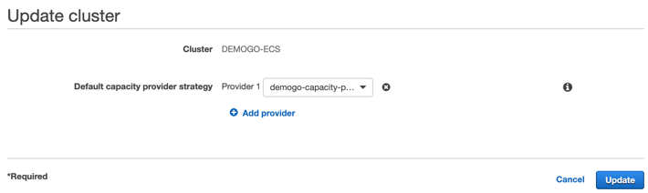

### ASG 구성

1. [Amazon EC2 Auto Scaling Groups](https://ap-northeast-2.console.aws.amazon.com/ec2/autoscaling/home?region=ap-northeast-2#AutoScalingGroups:view=details)으로 이동합니다.

2. EC2ContainerService-DEMOGO-ECS-EcsInstanceAsg을 선택하고 Scaling Policies 탭을 열어 Add policy를 클릭합니다.

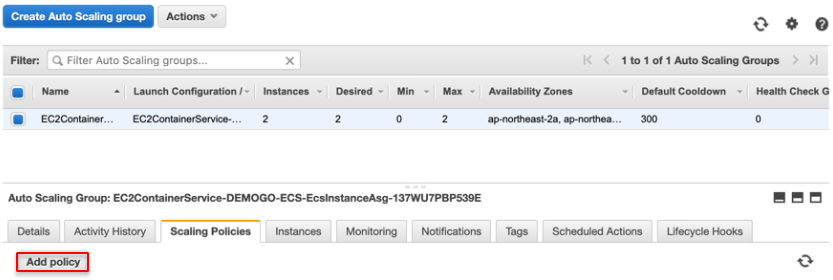

3. 조정 정책을 설정합니다.

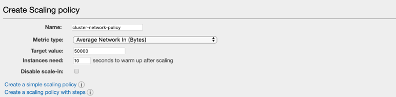

- Name: cluster-as-policy

- Metric type: Average Network In (Bytes)

- Target value: 50000

- Instances need: 10 seconds

본 실습에서는 빠른 결과 확인을 위해 의도적으로 낮은 임계치를 설정합니다.

1. Create을 클릭합니다.

2. EC2ContainerService-DEMOGO-ECS-EcsInstanceAsg을 선택하고 Actions를 눌러 Edit을 선택합니다.

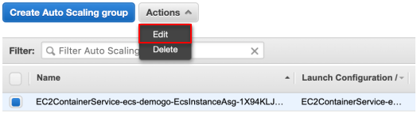

3. ASG를 설정합니다. 그 외 설정은 기본값으로 남겨둡니다.

- Min: 2

- Max: 4

- default cooldown: 10

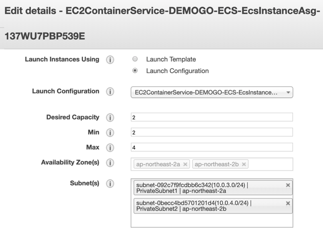

4. Save를 클릭합니다.

### 클러스터 부하 테스트

1. Workstation 인스턴스에 접속합니다.

```
ssh -i [key pair name.pem] ec2-user@[Workstation Public IP]
```

2. 예시로 넣어둔 cluster_loadtest.sh의 내용을 살펴봅니다.

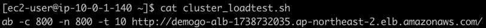

```
cat cluster_loadtest.sh
```

3. vi 편집기를 이용해 URL을 demogo-alb의 DNS 이름으로 대체한 cluster_loadtest_실습자이름.sh 스크립트를 작성하고 권한을 부여합니다.

```
vi cluster_loadtest_[실습자이름].sh
ab -c 800 -n 800 -t 10 [실습자의 ALB DNS name] + /
ab -c 800 -n 800 -t 10 [실습자의 ALB DNS name] + /cats
ab -c 800 -n 800 -t 10 [실습자의 ALB DNS name] + /dogs
```

- :wq!를 눌러 vi 편집을 마칩니다.

```
chmod 755 cluster_loadtest_[실습자 이름].sh
```

4. cluster_loadtest.sh를 연속으로 최소 3분 이상 실행하여 부하 테스트를 수행합니다.

```
./cluster_loadtest_[실습자이름].sh 
```

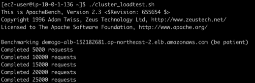

### 결과 확인
#### CloudWatch Alarms

CloudWatch Alarms로 이동합니다.

1. 목표 추적(Target tracking)의 상태가 Insufficient data일 수도 있습니다. 목표 추적 조정 정책은 지정한 메트릭의 데이터가 충분하지 않을 때 조정을 수행하지 않습니다.

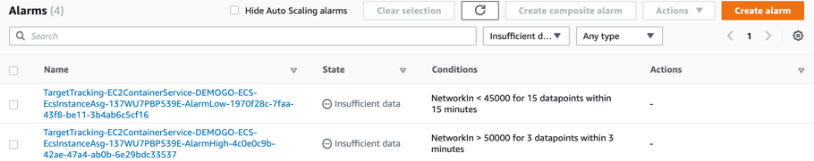

2. 만약 상태가 In alarm으로 바뀌지 않는다면, Workstation에서 cluster_loadtest.sh 스크립트를 연속으로 몇 번 더 실행합니다.

```
./cluster_loadtest_[실습자 이름].sh 
```

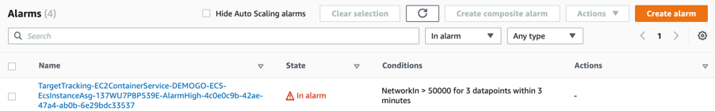

3. 알람 이름을 클릭합니다. 빨간색 기준선 Networking > 50000을 초과했는지 확인합니다.

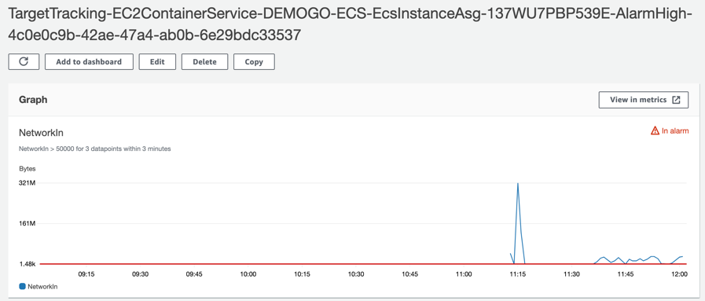

#### Amazon ECS

1. [Amazon ECS](https://console.aws.amazon.com/ecs)에서 ECS Instances 탭을 열어 살펴봅니다.

2. ECS 인스턴스의 수가 4개가 되었음을 알 수 있습니다. 새로 추가된 인스턴스에는 아직 태스크가 분배되지 않았습니다.

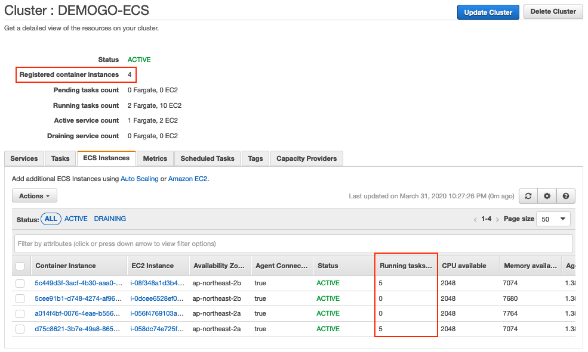

3. 만약 새로 시작하는 태스크가 있다면 ECS는 태스크가 적은 인스턴스에 태스크를 분배합니다.SpreadTasks

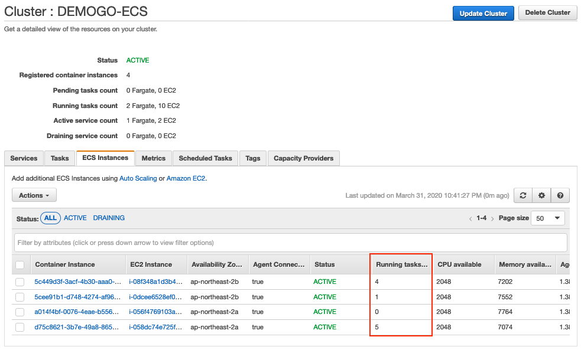

#### 모니터링 복습

1. Metrics 탭으로 이동합니다. 기본적인 지표들을 확인할 수 있습니다. View Container Insights를 누르면 CloudWatch Container Insight로 이동하게 됩니다.

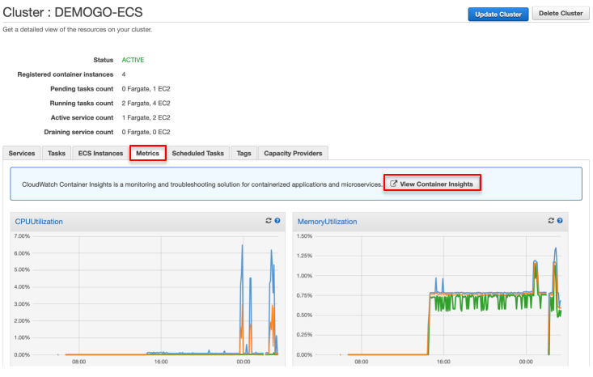

2. Container Insights는 ECS 클러스터의 보다 상세한 정보를 보여줍니다. ECS 클러스터의 조정 트리거로 설정한 네트워크 트래픽(bytes/second) 지표도 확인할 수 있습니다. 마우스를 그래프 위에 올려두면 특정 시점의 수치를 확인할 수 있습니다.

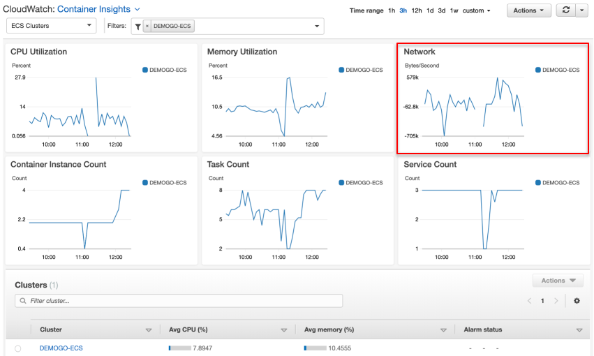