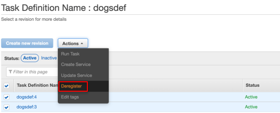
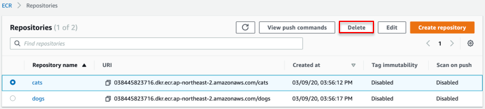
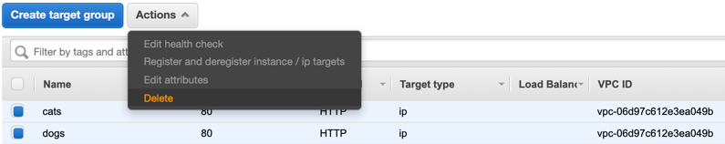
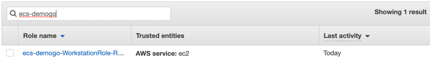
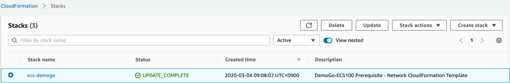
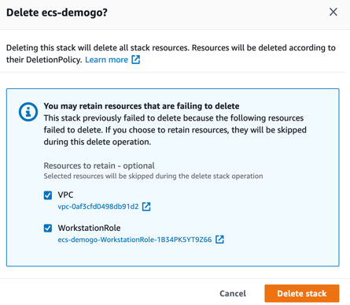
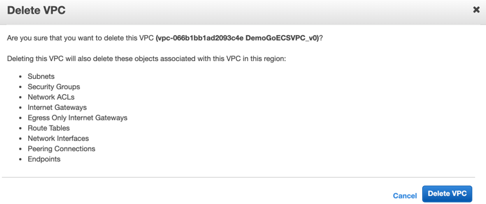
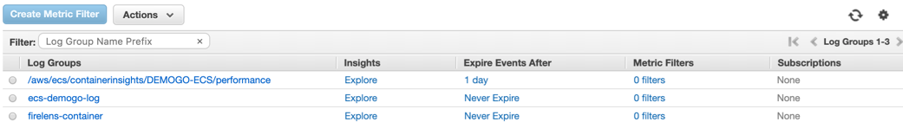

# 실습 리소스 정리

1. [Amazon ECS](https://console.aws.amazon.com/ecs) Task Definitions으로 이동하여 catsdef와 dogsdef를 각각 클릭하여 모두 선택한 후 Actions를 눌러 deregister를 클릭합니다.

2. [Amazon ECR](https://console.aws.amazon.com/ecr) Repositories로 이동하여 cats와 dogs를 삭제합니다.

3. [Amazon EC2](https://console.aws.amazon.com/ec2) Load Balancer로 이동하여 demogo-alb를 삭제합니다.

4. 타겟 그룹에서 web, cats, dogs를 삭제합니다.CleanUp3

5. IAM role에서 ecs-demogo를 검색하여 삭제합니다.

6. [CloudFormation](https://console.aws.amazon.com/cloudformation)에서 ecs-demogo 스택을 삭제합니다.

7. 만약 삭제하지 못하는 리소스가 있다면 모두 선택하고 Delete stack을 클릭합니다.

8. [VPC](https://console.aws.amazon.com/vpc)로 이동하여 DemoGoECSVPC를 수동으로 삭제합니다.

9. [Amazon CloudWatch Log groups](https://console.aws.amazon.com/cloudwatch)로 이동하여 다음 리소스를 삭제합니다.

- /aws/ecs/containerinsights/DEMOGO-ECS/performance

- ecs-demogo-log

- firelens-container